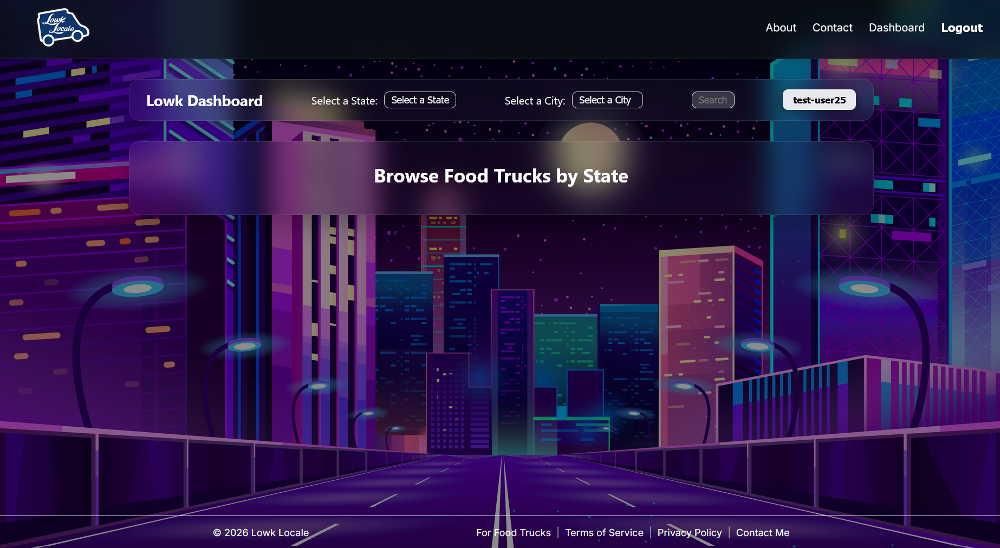

[Lowk Locale](https://lowklocale.com/) is a production-grade, high-performance web platform designed to bridge the gap between mobile businesses and their customers in real time. Beyond a simple directory, it serves as a comprehensive business management suite that enables food trucks and vendors to broadcast their locations, manage subscriptions, and engage their audience through a secure, enterprise-level architecture.

## Key Features & Client Benefits

- **Real-Time Engagement:** Built a "Live Broadcast" system allowing businesses to instantly update their status and location, ensuring customers always have the most current information.

- **Robust Security & Privacy:** Integrated multi-role authentication (Customer vs. Business) using industry-standard JWT validation and Amazon Cognito. This ensures sensitive business data and customer profiles remain private and secure.

- **Enterprise-Grade Reliability:** Architected on a Serverless Infrastructure (AWS). For a client, this means the website scales automatically to handle thousands of simultaneous users during peak hours without slowing down or requiring manual server management.

- **Optimized Performance:** Leveraged advanced database indexing and query optimization to ensure lightning-fast search results, even as the vendor database grows.

- **Data-Driven Insights:** Implemented structured logging and observability, providing the ability to monitor platform health and user engagement—critical for making informed business decisions.