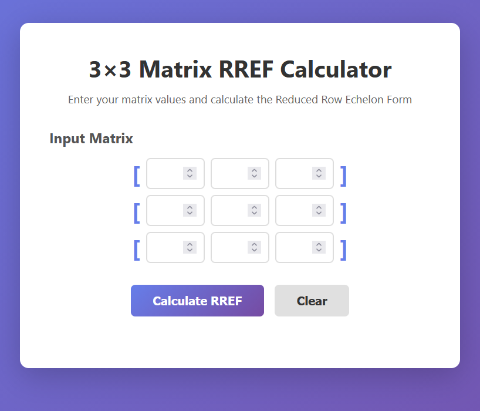

[This project](https://lehig.github.io/Row-Reduction/) demonstrates the ability to transform complex mathematical models and proprietary business logic into a high-performance, web-based tool. While many developers rely on pre-built libraries, this application features a from-scratch engine designed for precision, speed, and cross-platform flexibility.

## Key Strengths & Client Value

- **Bespoke Logic Development:** Rather than using generic "black box" libraries, I implemented a custom Gaussian elimination engine. This proves I can code complex, custom-tailored algorithms for niche industries like finance, logistics, or engineering.

- **Dual-Environment Deployment:** Engineered to be "environment agnostic." It can run as a standard local service for internal office use or as a cost-effective, serverless AWS Lambda function for global web access.

- **Real-Time Data Validation:** The user interface provides instant feedback, ensuring that only valid data is processed. This reduces user error and prevents backend "crashes"—a critical requirement for any business-facing tool.

- **Production-Ready Testing:** Every line of logic is backed by automated tests. For a client, this means fewer bugs, lower maintenance costs, and a tool that works correctly every single time.

- **Clean, Professional UI:** Transformed a complex technical process into a simple, intuitive interface that anyone can use without a manual.

> **Note**: I developed this to demonstrate that high-level concepts — such as Linear Algebra — can be successfully translated into lightweight, scalable software solutions for businesses that need more than just a basic template.